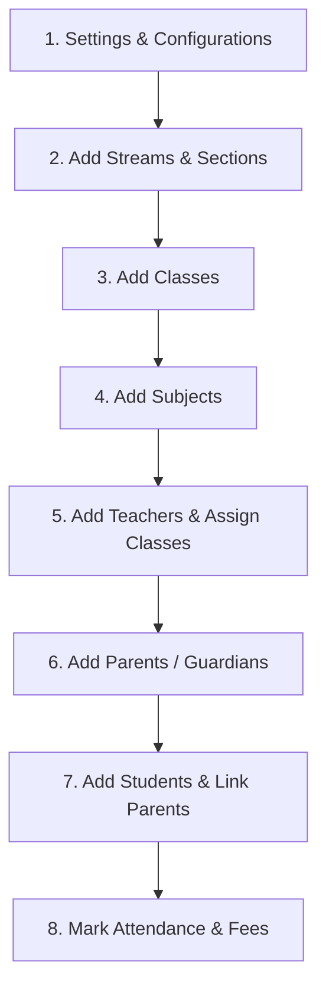

# School Management System Setup Guide (स्कूल सेटअप मार्गदर्शिका)

इस गाइड में आपको स्टेप-बाय-स्टेप बताया गया है कि नए स्कूल का डेटा सिस्टम में कैसे एंटर करना है, कहाँ से शुरुआत करनी है, और डेटा एंट्री का सही क्रम (order) क्या होना चाहिए।

---

## 📋 डेटा एंट्री का सही क्रम (Recommended Setup Order)

डेटा में कोई गड़बड़ी न हो, इसलिए नीचे दिए गए क्रम का पालन करें:

---

## 🛠️ Step 1: settings & Configurations (सेटअप और सेटिंग्स)
सबसे पहले स्कूल की बुनियादी सेटिंग्स को चालू या बंद करें।
* **कहाँ जाएं**: `Dashboard` -> `Settings` (Top Right Profile Icon -> Settings / Profile -> Academic Settings Tab)
* **क्या एंटर करें**:
  * **Enable Streams**: अगर स्कूल में 11th & 12th में Streams (Science, Commerce, Arts) चलती हैं, तो इसे **ON** करें।
  * **Enable Sections**: अगर हर क्लास में एक से अधिक सेक्शंस (A, B, C) हैं, तो इसे **ON** करें।

---

## 🧬 Step 2: Streams & Sections (स्ट्रीम्स और सेक्शंस जोड़ना)
अगर आपने Step 1 में इन्हें ऑन किया था, तो अब इनके नाम जोड़ें।
* **कहाँ जाएं**: Sidebar में `Academic Mgmt` -> `Streams` & `Sections`
* **क्या एंट्री करें**:
  * **Streams**: `Science`, `Commerce`, `Arts` आदि।
  * **Sections**: `A`, `B`, `C`, `Gold`, `Silver` आदि।

---

## 🏫 Step 3: Add Classes (क्लासेस जोड़ना)
अब स्कूल में उपलब्ध कक्षाएं (Classes) दर्ज करें।
* **कहाँ जाएं**: Sidebar में `Academic Mgmt` -> `Classes`
* **क्या एंट्री करें**:
  * **Class Name**: `Class 9`, `Class 10`, `Class 11 Science` आदि।
  * **Select Stream**: (यदि लागू हो)
  * **Select Sections**: इस क्लास में कौन-कौन से सेक्शन हैं (जैसे `A` और `B`) उन्हें टिक करें।

---

## 📚 Step 4: Add Subjects (विषय जोड़ना)
जो विषय स्कूल में पढ़ाए जाते हैं उन्हें दर्ज करें।
* **कहाँ जाएं**: Sidebar में `Academic Mgmt` -> `Subjects`
* **क्या एंट्री करें**:
  * **Subject Name**: `Mathematics`, `English Literature`, `Chemistry` आदि।
  * **Subject Code**: (Optional) जैसे `MATH101`
  * **Class Assignment**: यह सब्जेक्ट किस-किस क्लास के लिए है, उसे चुनें।

---

## 👩‍🏫 Step 5: Add Teachers & Assign Classes (शिक्षक जोड़ना)
स्कूल के टीचर्स का डेटा एंटर करें और उन्हें क्लासेस असाइन करें।
* **कहाँ जाएं**: Sidebar में `Peoples` -> `Teachers` -> `Add Teacher`
* **क्या एंट्री करें**:
  * **Teacher Details**: नाम, ईमेल, फोन नंबर, क्वालिफिकेशन, जॉइनिंग डेट।
  * **Assign Classes**: वह टीचर किन कक्षाओं को पढ़ाता है।
  * **Assign Subjects**: वह टीचर कौन-से सब्जेक्ट्स पढ़ाता है।
* **Teacher Login**: टीचर का अकाउंट आटोमेटिक क्रिएट हो जाएगा। आप `Login Details` बटन पर क्लिक कर उनका यूजरनाम और पासवर्ड देख सकते हैं।

---

## 👨‍👩‍👦 Step 6: Add Parents / Guardians (अभिभावक जोड़ना)
स्टूडेंट्स को जोड़ने से पहले उनके माता-पिता/अभिभावकों की एंट्री करें ताकि स्टूडेंट को जोड़ने समय उन्हें डायरेक्ट लिंक किया जा सके।
* **कहाँ जाएं**: Sidebar में `Peoples` -> `Parents` -> `Add Parent`
* **क्या एंट्री करें**:
  * **Full Name**: माता या पिता का नाम।
  * **Phone Number**: (लॉगिन और नोटिफिकेशन्स के लिए आवश्यक)
  * **Email**: (यदि उपलब्ध हो)
  * **Address & Occupation**: पता और व्यवसाय।

---

## 🎓 Step 7: Add Students (छात्रों की एंट्री)
अब छात्रों को क्लास, रोल नंबर और उनके माता-पिता के साथ दर्ज करें।
* **कहाँ जाएं**: Sidebar में `Peoples` -> `Students` -> `Add Student`
* **क्या एंट्री करें**:
  * **Student Details**: नाम, जन्मतिथि (DOB), जेंडर, एडमिशन नंबर (Admission No), रोल नंबर (Roll No)।
  * **Class & Section**: छात्र किस क्लास और किस सेक्शन में है।
  * **Link Parent**: Step 6 में जोड़े गए अभिभावक का नाम सर्च कर सिलेक्ट करें।

---

## 📈 Step 8: Daily Operations (रोजमर्रा का काम)
सभी सेटअप पूरे होने के बाद आप निम्नलिखित कार्य शुरू कर सकते हैं:
* **Attendance**: `Attendance` -> `Student Attendance` में जाकर रोज हाजिरी लगायें।
* **Fees Collection**: `Peoples` -> `Students` -> किसी भी छात्र के आगे `Collect Fees` पर क्लिक कर फीस जमा करें।
* **Reports**: `Reports` में जाकर छात्रों की हाजिरी, फीस की बकाया सूची (Pending Fees) और क्लास रिपोर्ट्स देखें।

---

### 💡 महत्वपूर्ण सुझाव (Important Tips)
1. **गलत क्रम से बचें**: क्लास बनाने से पहले सेक्शंस और स्ट्रीम्स ज़रूर बना लें, नहीं तो क्लास बनाते समय आप सेक्शंस सिलेक्ट नहीं कर पाएंगे।
2. **टीचर्स और स्टूडेंट्स का लॉगिन**: टीचर्स और छात्रों के लिए लॉगिन क्रेडेंशियल्स आटोमेटिक बन जाते हैं। आप लिस्ट में ऐक्शन मेनू (`...`) से `Login Details` देख सकते हैं।
3. **डेटा रिफ्रेश**: जब भी कोई बदलाव करें, लिस्ट के ऊपर बने रीफ्रेश बटन (`Refresh`) पर क्लिक करें, पेज को रीलोड करने की आवश्यकता नहीं है।
